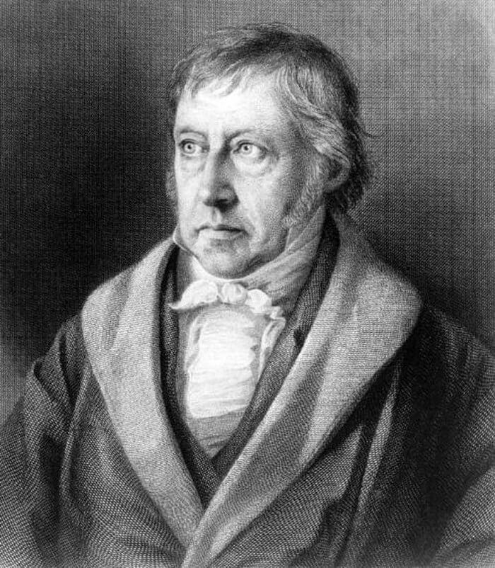

# Наука логики
* Подготовка издания книги
* Сайты: [tehnokom.su](https://tehnokom.su), [r-p-w.ru](https://www.r-p-w.ru/)
* [Средство механизации вычитки](https://github.com/kekcleader/ProofHegel)

## Установка необходимого программного обеспечения

* Вёрстка осуществляется с применением технологии LaTeX.

Установить LaTeX на ОС Дебиан или Убунту можно следующим образом:
```
apt-get install -y texlive-full make
```
После чего преобразовать исходный текст в книгу в формате PDF можно так:
```
make
```
или так (см. Makefile):

```
pdflatex gegel1.tex
```
Если не работает (ошибка «auto expansion»), выполните команду:
```
updmap
```

Для ОС Виндоус существует [программа TeXworks](https://github.com/TeXworks/texworks/releases),
для работы которой необхоим также пакет [MiKTeX](http://www.miktex.org).

Система LaTeX устроена таким образом, что для того, чтобы вполне
перевести текст в формат PDF, иногда необходимо несколько раз
запустить процесс компиляции. Интегрированные среды разработки
на LaTeX'е делают это сами.

Для перевода DOCX в формат LaTeX можно воспользоваться консольной
программой Write2LaTeX, доступной на Линуксе или одноимённым
подключаемым модулем для Libre Office Writer:
```
apt-get install writer2latex
w2l -ultraclean -config=a.conf Hegel_T1.odt
```

Файл `a.conf` при этом выглядит так:
```
<config>
  <option name="inputencoding" value="utf8" />
</config>
```
